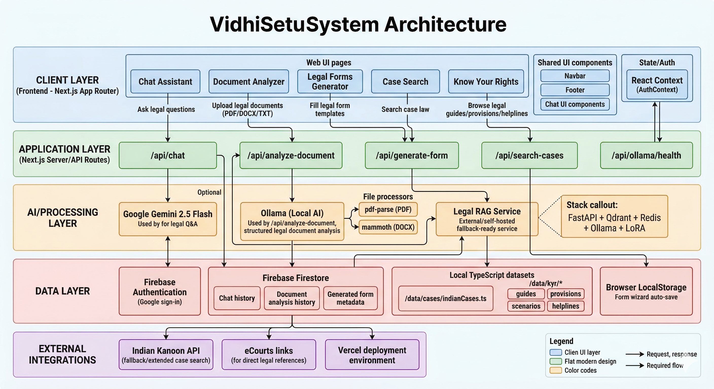

# VidhiSetu ⚖️

VidhiSetu is a comprehensive legal assistance platform that leverages artificial intelligence to make Indian legal services accessible and understandable for everyone. The platform serves as a one-stop solution for individuals seeking legal guidance, document analysis, and information about their rights under Indian law. It combines modern web technologies with AI capabilities to provide instant legal assistance, helping users navigate complex legal procedures without requiring prior legal knowledge.

## Features

### 1. AI Legal Assistant 🤖

**Purpose:** Provides instant answers to Indian law questions through conversational AI.

**How It Works:**
1. User types a question → `POST` to `/api/chat` with conversation history.
2. Backend sends the query to Google Gemini 2.5 Flash API with a legal expert system prompt.
3. AI generates a response citing relevant Indian laws and sections.
4. Response is displayed with markdown formatting and auto-saved to Firestore.
5. Supports multiple sessions, sidebar navigation, and persistent history.

**Key Features:** Multiple chat sessions, sidebar navigation, mobile swipe gestures, persistent history.

**Architecture — RAG + Gemini Hybrid**

The AI Legal Assistant is powered by a **Retrieval-Augmented Generation (RAG)** model purpose-built for Indian legal documents. The RAG service retrieves relevant case law, statutes, and legal provisions before generating a response, significantly improving accuracy and grounding compared to a plain LLM.

> 🔗 **RAG Model Repository:** [Legal\_RAG\_Service](https://github.com/prat555/Legal_RAG_Service)

**Current deployment note:** The RAG service requires a dedicated Virtual Machine (VM) to run, which incurs cloud infrastructure charges. To keep VidhiSetu accessible and free to use during development, **Google Gemini** is currently used as the fallback AI backbone for the chat feature. The full RAG pipeline will be enabled once a suitable hosting solution is in place.

**Tech Stack:**
- **App layer:** Google Gemini 2.5 Flash API, Firebase Firestore, react-markdown, Next.js API Routes
- **RAG layer:** FastAPI · Qdrant (vector store) · Redis (caching) · Ollama (local LLM inference) · LoRA (fine-tuning)

---

### 2. Document Analyzer 📄

**Purpose:** Analyzes legal documents and identifies risks, key terms, and provides actionable recommendations.

**How It Works:**
1. User uploads a file (PDF / DOCX / TXT) or pastes text → `POST` to `/api/analyze-document`.
2. Backend extracts text: `pdf-parse` for PDFs, `mammoth` for DOCX files.
3. Extracted text is sent to Ollama AI requesting a structured JSON response: `{ summary, keyPoints, risks, recommendations, indianLawRefs }`.
4. AI analyzes the document and returns color-coded results (blue / green / red / amber sections).
5. Analysis is saved to Firestore with export options available (TXT / PDF).

**Key Features:** Multi-format support (PDF, DOCX, TXT), color-coded risk analysis, export options, analysis history.

**Tech Stack:** pdf-parse, mammoth, Ollama AI, jsPDF (export), Firebase Firestore.

---

### 3. Legal Forms Generator 📝

**Purpose:** Creates professional legal documents through a guided, step-by-step wizard.

**How It Works:**
1. User selects from 8 available templates (NDA, Partnership Agreement, Service Agreement, etc.).
2. A multi-step wizard guides through: Party Info → Terms → Additional Clauses → Review.
3. Real-time validation on each field with auto-save to LocalStorage.
4. "Generate PDF" uses jsPDF to produce a professional document with branding and signature spaces.
5. PDF downloads automatically and is optionally saved to Firestore.

**Key Features:** 8 templates, multi-step validation, auto-save via LocalStorage, professional PDF output.

**Available Templates:** NDA, Partnership Agreement, Service Agreement, Affidavit, Power of Attorney, Rental Agreement, Offer Letter, Employment Contract.

**Tech Stack:** jsPDF (PDF creation), LocalStorage (auto-save), TypeScript (type-safe forms), Firebase Firestore.

---

### 4. Case Law Search 🔍

**Purpose:** Search Supreme Court and High Court judgments with citations and summaries.

**How It Works:**
1. User enters a query → `POST` to `/api/search-cases`.
2. Two-tier search: first searches a local curated database (`/data/cases/indianCases.ts`) using keyword matching and relevance scoring.
3. If results are fewer than 3, the system queries the Indian Kanoon API for additional judgments.
4. Results are displayed as cards with citation, court, date, summary, and full judgment links.
5. External links to Indian Kanoon and eCourts are provided for extended research.

**Key Features:** Two-tier search, curated landmark cases database, proper legal citations, external links.

**Database:** Curated landmark cases with structured metadata (title, citation, court, date, summary).

**Tech Stack:** Local TypeScript database, Indian Kanoon API integration, Next.js API Routes.

---

### 5. Know Your Rights 🛡️

**Purpose:** An educational module empowering citizens with accessible legal knowledge.

**How It Works:**
1. Static content is stored in `/data/kyr/`: `scenarios.ts`, `guides.ts`, `helplines.ts`, `provisions.ts`.
2. Next.js dynamic routing (`[id]`) generates individual pages automatically.
3. Four modules: **Scenarios** (8 real-life situations) → **Guides** (6 step-by-step legal procedures) → **Helplines** (15+ numbers with one-tap calling) → **Provisions** (10+ laws explained in simple language).
4. All content loads instantly via static generation — no API calls needed.

**Key Features:** 4 educational modules, dynamic routing, one-tap emergency calling, plain-language legal explanations.

**Content Stats:** 8 scenarios, 6 guides, 15+ helplines, 10+ legal provisions.

**Tech Stack:** TypeScript data files, Next.js dynamic routing (`[id]`), Static Site Generation (SSG).

---

## Technical Architecture

| Layer | Technologies Used |
|---|---|
| Frontend | Next.js 16 (App Router), TypeScript, Tailwind CSS 4, React Context |
| Backend | Next.js API Routes (Serverless) |
| AI Services | Google Gemini 2.5 Flash (Chat), Ollama (Local Document Analysis), Legal RAG Service (self-hosted) |
| RAG Service | FastAPI, Qdrant, Redis, Ollama, LoRA |
| File Processing | pdf-parse, mammoth, jsPDF, html2canvas |
| Database & Auth | Firebase Auth (Google), Firestore (NoSQL), LocalStorage |
| Deployment | Vercel (Auto-deployment), Secure Environment Variables |