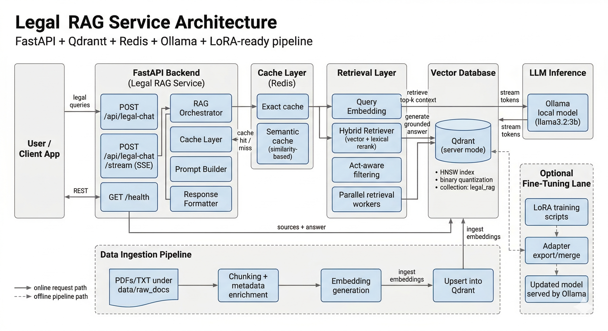

# Legal RAG Service

**FastAPI · Qdrant · Redis · Ollama · LoRA-ready**

A backend service for Indian legal question-answering built on Retrieval-Augmented Generation. Given a natural language query, the service retrieves the most relevant passages from your indexed legal corpus, feeds them as grounded context to a local LLM, and returns a cited answer — all without any external API calls or data leaving your machine.

---

## Architecture



## How It Works

The service is composed of five cooperating layers, each with a focused responsibility.

**Ingestion.** Before the API can answer anything, raw legal documents — PDFs and plain-text files placed under `data/raw_docs/` — need to be processed. Running `ingestion/ingest.py` reads every file, splits it into overlapping chunks, enriches each chunk with metadata (source filename, act name, section number), generates a dense embedding vector, and upserts the result into Qdrant. This step only needs to be re-run when you add new documents or change the embedding model.

**Retrieval.** When a query arrives at `/api/legal-chat`, the RAG Orchestrator first passes it through the Cache Layer. Redis stores two kinds of prior responses: an exact-match cache keyed on the literal query string, and a semantic cache that compares new queries against previously answered ones using embedding similarity. A sufficiently similar past query returns its cached answer immediately — no LLM call needed. If the cache misses, the query moves to the Retrieval Layer, where it is embedded and handed to the Hybrid Retriever. The Hybrid Retriever combines dense vector search with lexical (BM25-style) reranking and applies act-aware filtering so that, for example, a question about bail fetches chunks from criminal law acts rather than from property or family law. Parallel retrieval workers run these lookups concurrently to keep latency low. Top-k chunks are then fetched from Qdrant, which stores all vectors in an HNSW index with binary quantization for memory efficiency.

**Generation.** The Prompt Builder assembles a structured prompt from the retrieved chunks, then streams the prompt to Ollama running `qwen2.5:3b` locally by default. The model generates a grounded answer token by token; the streaming endpoint (`/api/legal-chat/stream`) forwards these tokens to the client via Server-Sent Events so users see output as it is produced rather than waiting for the full response.

**Response.** The Response Formatter packages the final answer together with the source document names and returns them as JSON. The `cached` field in the response tells the caller whether the answer came from Redis or was freshly generated.

**Fine-tuning (optional).** A separate LoRA lane in `scripts/` lets you fine-tune the base model on domain-specific legal data. Training scripts produce LoRA adapters that are exported, merged into the base weights, and served directly by Ollama — no architecture changes required.

---

## Project Structure

```
api/              FastAPI app, routes, orchestrator, prompt builder
ingestion/        Document ingestion pipeline
data/raw_docs/    Place your legal PDFs and TXT files here
scripts/          LoRA training, adapter export, utilities
```

---

## API Reference

### `POST /api/legal-chat`

Synchronous endpoint. Sends the full answer once generation is complete.

```json
// Request
{ "message": "What is anticipatory bail?" }

// Response
{
  "answer": "Anticipatory bail is a direction to release a person on bail...",
  "sources": ["criminal/Bharatiya_Nagarik_Suraksha_Sanhita_2023.pdf"],
  "cached": false
}
```

### `POST /api/legal-chat/stream`

Streaming endpoint using Server-Sent Events. Emits three event types: `meta` (sources and metadata), `token` (individual generated tokens), and `done` (signals end of stream). Use this when you want the UI to display output progressively.

### `GET /health`

Returns service status, the number of indexed chunks currently in Qdrant, and the state of the Redis connection.

---

## Important Notes

Even after fine-tuning the LLM, keep retrieval enabled in production. Without retrieved context the model will hallucinate legal citations. Retrieval is what makes answers grounded and trustworthy.

If you ever switch the embedding model, you must re-run `ingestion/ingest.py` to regenerate all vectors. Mixing embeddings from different models in the same Qdrant collection will silently produce wrong retrieval results.